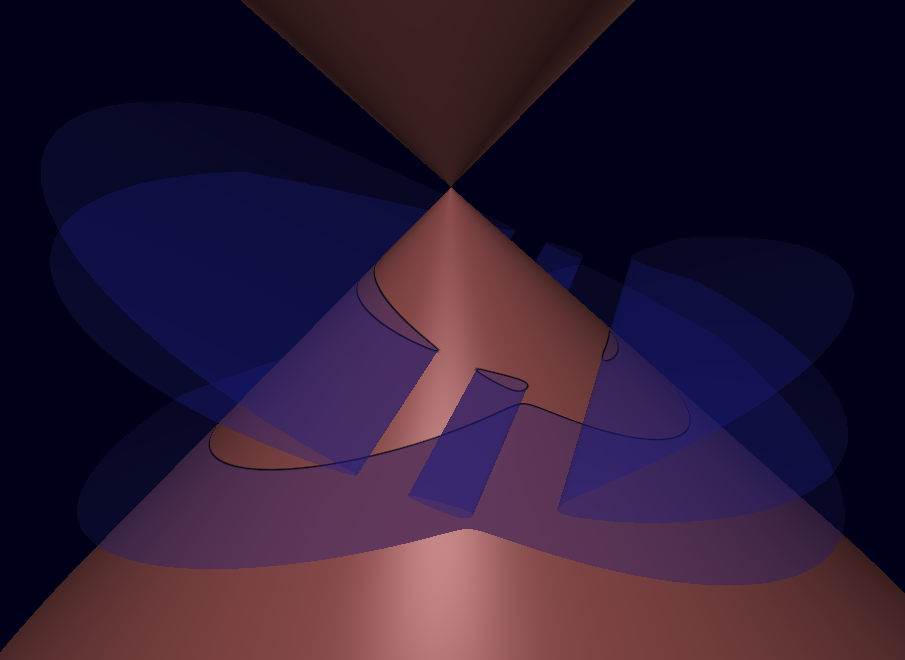

CamlSurf
========




CamlSurf provides a small scripting language for defining, animating and
displaying implicit algebraic geometry.

A script is a sequence of declarations and commands. Variables are immutable
and may denote either scalar values or expressions. The language also supports
functions and simple animation through the built-in
variable {!time}.


One or more script can be provided as argument on the command line:

```
./surface_x11.exe script1.surf script2.surf ...
```

Extra commands may be entered on the terminal after the last script is read.

Basic syntax
------------

Comments begin with `#` and continue to the end of the line.

```
# This is a comment
```

Statements are separated by semicolons.

```
let r = x^2 + y^2 + z^2;
surface sphere : r - 1;
```

Numeric expressions
-------------------

The following operators are available.

- `+`
- `-`
- `*`
- `/`
- `^`

Standard mathematical functions include

- `sqrt`
- `sin`
- `cos`
- `tan`
- `asin`
- `acos`
- `atan`
- `exp`
- `log`
- `abs`
- `sgn` (used for the derivative of abs)
- `positive` (1 if argument is positive, 0 otherwise, mainly used for the
  derivative of `max` and `min`)
- `negative` (1 if argument is negative, 0 otherwise, mainly used for the
  derivative of `max` and `min`)

We provide also some binary functions

- `min`
- `max`

Example:

```
let phi = (1 + sqrt(5)) / 2;
let t = cos(time / 10);
```

Constant such as `pi`, `e` are not predefined. Then can be defined by

```
let pi = acos(-1);
let e = exp(1);
```

Expressions
-----------

The variables

- `x`
- `y`
- `z`

represent the coordinates in space when drawing surfaces. Expression may use
arbitrary variables, but surfaces and curves must only use `x`, `y`, `z` and
`time` when doing animation.

Expressions may freely combine arithmetic operations, scalar
parameters and use previously defined functions.

```
let p = x^2 + y^2 + z^2 - r^2;
```

Definitions
-----------

Definitions are introduced with

```
let name = expression;
```

Example

```
let a = 0.2;
let sphere = x^2 + y^2 + z^2 - a;
```

Variables are immutable, using a variable before giving its definition will
not modify the value of the variable. In fact, an undefined name represents a
variable (a parameter) and become a definition as soon as it is define.

Redefining a name just hide the previous definition but does not change the
value of expression using the old definition.

Example (not recommanded)
```
let sphere = x^2 + y^2 + z^2 - a;  # a is a free parameter
let a = 0.2;
let sphere = sphere[a <- a]; # now a is defined as 0.2
```

Functions
---------

Functions can be declared using

```
let name(arg1,...,argn) = expression;
```

Example

```
let q(x,y,z) = x^2 + y^2 - z^2 - 2;
```

and later used as

```
surface hyperboloid : q(x,y,z);
```

Arguments may themselves be expressions.

Special transformation on expressions
-------------------------------------

Some operations are provided and may be used used inside expressions:

- `simplify(p)` to perform basic simplification.
- `develop(p)` to develop all polynomial within `p`.
- `derive(p,var)` to derive an expression in a variable.
- `p[var1 <- e1, ..., varn <- en]` to perform substitution.

A command allow to print expressions:

- `print e`

Example:

```
let p = (2*x - x + y)*(x - y);
print p;           # yield  (2*x - x + y)*(x - y)
print simplify(p); # yield (x + y)*(x - y)
print develop(p);  # yield x^2 - y^2
```

Surfaces
--------

A surface is defined by an implicit equation

```
surface name : expression;
```

Example

```
surface sphere : x^2 + y^2 + z^2 - 1;
```

A bounding expression may be specified.

```
surface sphere :
  x^2+y^2+z^2-1
  bound x^2+y^2+z^2-9;
```

Only the connected component satisfying the bound < 0 is rendered.

Curves
------

A curve is the intersection of two implicit surfaces.

Syntax:

```
curve name : polynomial on surface;
```

Example

```
let p = z;
curve equator : p on sphere;
```

Removing objects
----------------

Objects may be removed dynamically.

```
remove sphere;
remove equator on sphere;
```

Rendering properties
--------------------

Some properties may be used to control the rendering of curves and
surfaces. Each surface or curve will record the current value of these
properties. Properties currently include.

- `color = (r,g,b[,a])` : color for surfaces (default `(0.75,0.75,0.4,1.0)`)
- `back_color = (r,g,b,[,a])` : color for the backface of surfaces (default `(0.75,0.4,0.4,1.0)`)
- `back_color = none` : use `color` for both faces.
- `line_color = (r,g,b,[,a])` : color for curves (default `(1.0,1.0,1.0,1.0)`)
- `specular = value` : intensity of specular light (default 0.25)
- `shininess = value` : dispersion of specular light (default 50)
- `precision = value` : control the root finding algorithm. Shoud be in
  `]0,1]`. Near 0, algorithme is more precise but slower. Conversely, near to
  1 algorithme is faster but may loose some roots (default 0.1).
- `mindivs = value` minimum number of subdivisions performed when searching for
  roots (default 0).

Colors are specified as

```
(r,g,b,a)
```

where each component belongs to `[0,1]`.

A block may be used to modify rendering attributes locally. However,
definition of expressions are always global.

Example to draw a transparent sphere not modifying the current color.
```
{
  color = (0.8,0.2,0.2,0.5);
  back_color = none;

  surface s : x^2+y^2+z^2-1;
}
```

Some global variables also control the rendering and affect all objects:

- `far = value` (only parts of the surface nearer than the value will be displayed)
- `near = value` (only parts of the surface further than the value will be
- `translateX value`, `translateY value`, `translateZ value` translate the
  view
- `rotateX value`, `rotateY value`, `rotateZ value` rotate the
  view around `(0,0,0)`, alway aplied before the translation.


Animation
---------

The predefined variable

```
time
```

contains the elapsed time in seconds.

Example

```
let t = cos(time/10);

surface moving :
    x^2+y^2+z^2-t;
```

Timing
------

Execution may be paused using

```
sleep seconds;
wait; # wait until the space key is pressed
```

Example

```
sleep 5;
```

Any pause may be interrupted with the space key.

Key bindings
------------

The following key binding are provided:

- Right/Left : rotate around Y axes (vertical axes).
- Up/Down : rotate around the X axes (horizontal axes).
- PageUp/PageDown : translate along Z axes (axes orthodonal to the screen).
- Space : interrupt the current pause.
- I : display or hide the information text displayed on the screen (giving fps).
- F : increase the far parameter (decrease if shit is pressed).
- N : increase the near parameter (decrease if shit is pressed).

Example: cone/cubic intersection
--------------------------------

```
let cone = x^2 + y^2 - z^2;
surface cone : cone;

let p0 = - z - 1;

line_color = (1.0, 0.0, 0.0);
curve p0 : p0 on cone;

sleep 5;

let a = 0.27;
let b = 0.002;
let c = 1e-4;

let p1 = p0 + a * (x+0.8);
let p2 = p0 - a * (x+0.8);
let p3 = x - 2*z - 1.5;

line_color = (0.0, 0.7, 0.0);
curve cp1 : p1 on cone;
curve cp2 : p2 on cone;
curve cp3 : p3 on cone;

sleep 5;

remove p0 on cone;

sleep 10;

let q = p1*p2 + b;

line_color = (0.0, 0.0, 1.0);
curve cq : q on cone;

sleep 5;

remove cp1 on cone;
remove cp2 on cone;

sleep 5;

let cubic = q*p3 - c;

line_color = (0.0, 0.0, 0.0);
curve cc : cubic on cone;

sleep 5;

remove cp3 on cone;
remove cq on cone;

sleep 5;

{
  color = (0.2,0.2,0.9,0.35);
  back_color = none;
  surface cubic : cubic bound x^2 + y^2 - 6;
}
```

Example: animated Barth sextic
------------------------------

```
let phi = (1+sqrt(5))/2;
let t = min(1.1*cos(time/11)+0.1,1)*phi;
let a = min(1.1*cos(time/13)+0.1,1)*(1+2*phi);

let p =
    4*(t^2*x^2-y^2)
     *(t^2*y^2-z^2)
     *(t^2*z^2-x^2)
    -a*(x^2+y^2+z^2-1)^2;

surface barth :
    p
    bound x^2+y^2+z^2-5;
```

This example illustrates the use of {!time} to continuously deform a surface.
